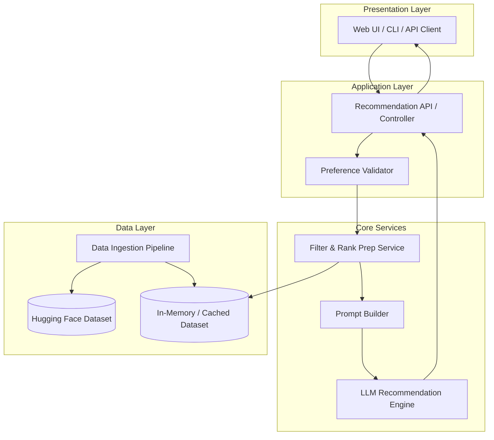
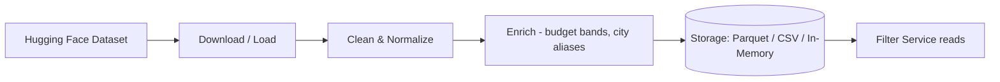
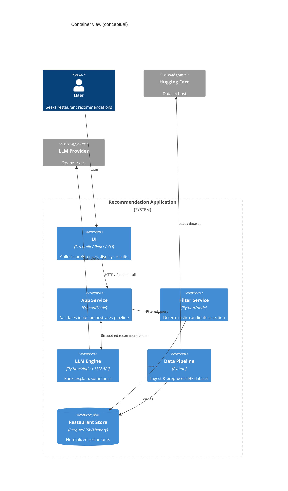
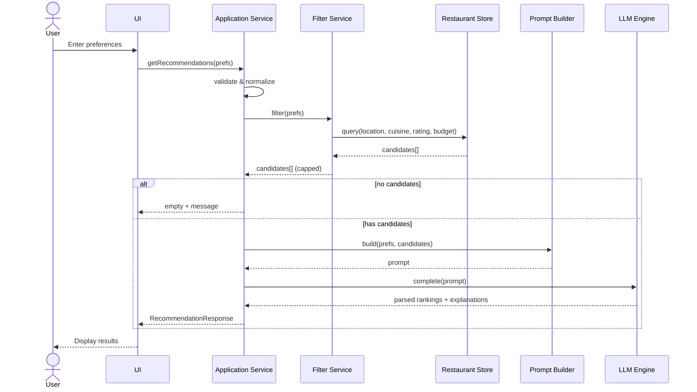
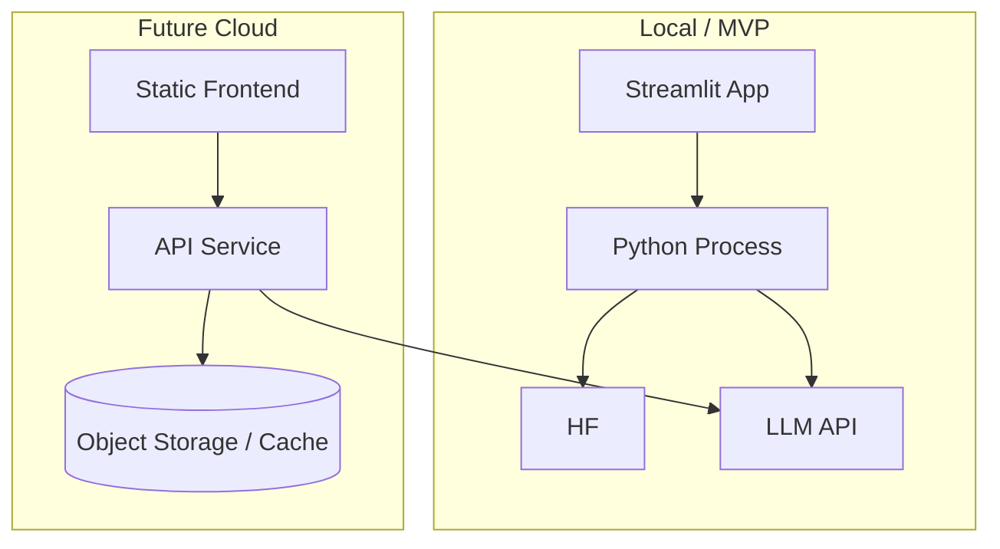

# System Architecture: AI-Powered Restaurant Recommendation System

This document defines the technical architecture for the Zomato-inspired recommendation service described in [`context.md`](context.md). It translates product requirements into components, data flows, interfaces, and implementation guidance.

---

## 1. Architectural Goals

| Goal | Description |
|------|-------------|
| **Hybrid intelligence** | Combine fast, deterministic filtering on structured data with LLM reasoning for ranking and explanations |
| **Separation of concerns** | Isolate data loading, filtering, LLM orchestration, and presentation |
| **Testability** | Allow unit tests on filters and parsers without calling the LLM; mock LLM in integration tests |
| **Extensibility** | Swap LLM provider, UI (CLI/web/API), or storage without rewriting core logic |
| **User clarity** | Every recommendation exposes name, cuisine, rating, cost, and a human-readable rationale |

---

## 2. High-Level System View

The system follows a **pipeline architecture**: user preferences flow through ingestion and filtering, then through an LLM-backed recommendation engine, and finally to a presentation layer.



---

## 3. Layered Architecture

### 3.1 Presentation Layer

**Responsibility:** Collect user preferences and render recommendations.

| Concern | Details |
|---------|---------|
| **Inputs** | Location, budget tier, cuisine, minimum rating, free-text extras (e.g., family-friendly) |
| **Outputs** | Ranked list: restaurant name, cuisine, rating, estimated cost, AI explanation; optional summary |
| **Options** | Streamlit/React web app, terminal CLI, or REST client consuming a JSON API |

**Design rules:**

- No business logic beyond form validation and display formatting
- Show loading state while LLM runs (latency can be several seconds)
- Graceful empty state when filters match zero restaurants

### 3.2 Application Layer

**Responsibility:** Orchestrate requests, validate input, coordinate services, shape API responses.

| Component | Role |
|-----------|------|
| **Recommendation controller** | Single entry point: `getRecommendations(preferences) → RecommendationResponse` |
| **Preference validator** | Normalize location strings, map budget to cost ranges, enforce rating bounds |
| **Response mapper** | Map internal models to stable JSON/UI DTOs |

**Suggested interface:**

```python
# Conceptual — language-agnostic
class UserPreferences:
    location: str
    budget: Literal["low", "medium", "high"]
    cuisine: str | None
    min_rating: float
    additional: str | None  # free-text extras

class RecommendationItem:
    name: str
    cuisine: str
    rating: float
    estimated_cost: str | float
    explanation: str
    rank: int

class RecommendationResponse:
    items: list[RecommendationItem]
    summary: str | None
    metadata: dict  # e.g., candidates_considered, filters_applied
```

### 3.3 Core Services Layer

**Responsibility:** Filtering, prompt construction, LLM invocation, and parsing structured LLM output.

#### 3.3.1 Filter & Rank Prep Service

| Step | Action |
|------|--------|
| 1 | Load normalized restaurant records from cache |
| 2 | Apply hard filters: location, cuisine, min rating, budget → cost band |
| 3 | Cap candidate set (e.g., top 20–50 by rating) to control token usage |
| 4 | Serialize candidates to a compact tabular/text block for the prompt |

**Budget mapping (example):**

| Budget | Cost interpretation |
|--------|---------------------|
| low | Below dataset median or cost ≤ threshold T1 |
| medium | Between T1 and T2 |
| high | Above T2 |

Thresholds should be derived from dataset statistics during preprocessing.

#### 3.3.2 Prompt Builder

Constructs a deterministic prompt template including:

- System role: expert restaurant recommender for Indian cities (Zomato context)
- User constraints (structured bullet list)
- Candidate restaurant table (id, name, location, cuisine, rating, cost)
- Instructions: rank top N, explain fit per restaurant, optional one-paragraph summary
- Output format: JSON schema or markdown sections for reliable parsing

#### 3.3.3 LLM Recommendation Engine

| Concern | Approach |
|---------|----------|
| **Provider** | OpenAI, Anthropic, Google Gemini, or local model via Ollama — abstract behind `LLMClient` interface |
| **Invocation** | Single completion per request (candidates already filtered) |
| **Parsing** | Parse JSON from model; validate required fields; fallback regex if malformed |
| **Retries** | Retry once on parse failure with “respond only in JSON” reminder |
| **Fallback** | If LLM fails: return filter-only ranking by rating with generic explanation |

### 3.4 Data Layer

**Responsibility:** Load, clean, normalize, and serve restaurant data.



| Stage | Tasks |
|-------|--------|
| **Download** | `datasets.load_dataset("ManikaSaini/zomato-restaurant-recommendation")` |
| **Extract** | name, specific location (locality/neighborhood such as Indiranagar, Bellandur), cuisine, cost, rating |
| **Normalize** | Trim strings, prioritize specific local neighborhood names over broad city-level columns, parse numeric rating/cost |
| **Enrich** | Compute `budget_band`, deduplicate rows, drop invalid records |
| **Persist** | Cache processed file locally to avoid repeated HF downloads |

---

## 4. Component Diagram (Detailed)



---

## 5. End-to-End Data Flow

### 5.1 Startup / Bootstrap Flow

```
1. Data Pipeline runs (once or on schedule)
2. Fetch dataset from Hugging Face
3. Preprocess → write processed_restaurants.parquet (or load into memory)
4. Application ready to serve requests
```

### 5.2 Request Flow (Runtime)

```
1. User submits preferences via UI
2. Application Layer validates and normalizes preferences
3. Filter Service queries Restaurant Store
   → returns 0..K candidates (K capped, e.g. 30)
4. If candidates == 0 → return empty result with message (skip LLM)
5. Prompt Builder assembles system + user + candidate context
6. LLM Engine calls provider → receives ranked list + explanations
7. Response Mapper builds RecommendationResponse
8. Presentation Layer renders cards/table with all required fields
```

### 5.3 Sequence Diagram



---

## 6. Domain Model

### 6.1 Restaurant (normalized)

| Field | Type | Notes |
|-------|------|-------|
| `id` | string | Stable identifier for LLM references |
| `name` | string | Display name |
| `location` | string | Neighborhood or locality (e.g., Indiranagar, Bellandur) |
| `cuisine` | string | May be multi-value; store as string or list |
| `rating` | float | e.g., 0.0–5.0 |
| `cost` | float or string | Normalize to numeric where possible |
| `budget_band` | enum | `low` \| `medium` \| `high` (derived) |

### 6.2 UserPreferences

Aligned with [`context.md`](context.md):

- `location` (required)
- `budget` (required): low | medium | high
- `cuisine` (optional)
- `min_rating` (required)
- `additional` (optional): free-text for LLM (family-friendly, quick service)

### 6.3 RecommendationItem (output contract)

Must satisfy success criteria from context:

- `name`, `cuisine`, `rating`, `estimated_cost`, `explanation`
- `rank` (1-based order)

---

## 7. Integration Layer Design

The **integration layer** bridges structured data and the LLM (per context workflow §3).

### 7.1 Responsibilities

1. **Translate** user preferences into filter predicates
2. **Prepare** a bounded, structured candidate payload
3. **Encode** constraints explicitly in the prompt so the model does not invent restaurants

### 7.2 Candidate Payload Format

Prefer a compact JSON array embedded in the prompt:

```json
[
  {
    "id": "r_1042",
    "name": "Example Bistro",
    "location": "Bangalore",
    "cuisine": "Italian",
    "rating": 4.5,
    "cost": 800
  }
]
```

**Rules:**

- Only include fields present in the dataset
- Never ask the LLM to recommend restaurants not in the candidate list
- Include `id` so parsed output can be joined back to source rows for validation

### 7.3 Prompt Template Structure

```
[System]
You are a restaurant recommendation assistant for Indian cities.
You must only rank restaurants from the provided CANDIDATES list.
Return valid JSON matching the schema below.

[User constraints]
- Location: {location}
- Budget: {budget}
- Cuisine: {cuisine or "any"}
- Minimum rating: {min_rating}
- Additional preferences: {additional or "none"}

[CANDIDATES]
{json_candidates}

[Task]
1. Select and rank the top {N} restaurants (default N=5).
2. For each, write a 1–2 sentence explanation tied to user constraints.
3. Optionally provide a short summary paragraph.

[Output schema]
{
  "recommendations": [
    {
      "id": "string",
      "rank": 1,
      "explanation": "string"
    }
  ],
  "summary": "string | null"
}
```

Post-processing merges LLM `id` + `explanation` with filter service records to fill name, cuisine, rating, and cost.

---

## 8. Recommendation Engine

### 8.1 Division of Labor

| Task | Owner | Rationale |
|------|--------|-----------|
| Hard constraints (location, min rating, cuisine, budget band) | Filter Service | Fast, reproducible, no hallucination |
| Soft preferences (family-friendly, quick service) | LLM | Natural language understanding |
| Final ordering among valid candidates | LLM | Contextual trade-offs |
| Per-item explanation | LLM | Personalized narrative |
| Optional summary | LLM | UX polish |

### 8.2 Hallucination Controls

- Constrain prompts: “only from CANDIDATES”
- Validate every returned `id` exists in candidate set
- Drop or replace invalid entries; re-rank if needed
- Cap temperature (e.g., 0.2–0.5) for more consistent JSON

### 8.3 Performance

| Technique | Benefit |
|-----------|---------|
| Pre-filter to ≤30 candidates | Lower tokens, faster, cheaper |
| Cache processed dataset in memory | Sub-second filter queries |
| Async LLM call + spinner in UI | Better perceived latency |

---

## 9. Output Display Architecture

### 9.1 View Model

Each card/row binds to `RecommendationItem`:

```
┌─────────────────────────────────────────────┐
│ #1  Restaurant Name              ★ 4.5   │
│     Italian · Bangalore · ₹₹₹ (~₹800)      │
│     "Great fit because you wanted Italian   │
│      in Bangalore with a medium budget..."  │
└─────────────────────────────────────────────┘
```

### 9.2 Optional Summary Block

Render `RecommendationResponse.summary` above the list when the LLM returns it.

### 9.3 Empty & Error States

| State | UX |
|-------|-----|
| Zero matches after filter | Suggest relaxing cuisine, rating, or budget |
| LLM timeout / error | Show rating-sorted fallback with notice |
| Partial parse | Show valid items; log warning |

---

## 10. Suggested Project Structure

```
zomato-milestone/
├── context.md
├── architecture.md
├── docs/
│   └── ProblemStatement.txt
├── data/
│   └── processed/              # Cached parquet/csv (gitignored)
├── src/
│   ├── data/
│   │   ├── loader.py           # HF download
│   │   ├── preprocessor.py     # normalize, enrich
│   │   └── repository.py       # query interface
│   ├── models/
│   │   ├── restaurant.py
│   │   ├── preferences.py
│   │   └── recommendation.py
│   ├── services/
│   │   ├── filter_service.py
│   │   ├── prompt_builder.py
│   │   └── recommendation_service.py  # orchestrator
│   ├── llm/
│   │   ├── client.py           # provider abstraction
│   │   └── parser.py
│   └── app/
│       ├── api.py              # FastAPI optional
│       └── ui.py               # Streamlit/CLI entry
├── tests/
│   ├── test_filter_service.py
│   └── test_prompt_builder.py
├── requirements.txt
└── .env.example                # LLM_API_KEY (not committed)
```

---

## 11. Technology Stack (Recommended)

| Layer | Option A (Python-focused) | Option B |
|-------|----------------------------|----------|
| Language | Python 3.11+ | Node.js / TypeScript |
| Dataset | `datasets`, `pandas` | Same via Python microservice |
| Storage | In-memory DataFrame or Parquet | SQLite for larger scale |
| API | FastAPI | Express |
| UI | Streamlit (fastest MVP) | React + Vite |
| LLM | OpenAI / Anthropic SDK | Same |
| Config | `pydantic-settings`, `.env` | `dotenv` |

**MVP path:** Python + pandas + Streamlit + single LLM provider — minimal moving parts while honoring the five workflow stages from context.

---

## 12. API Design (Optional REST Layer)

If exposing HTTP for a decoupled frontend:

| Method | Path | Body | Response |
|--------|------|------|----------|
| `POST` | `/api/v1/recommendations` | `UserPreferences` JSON | `RecommendationResponse` |
| `GET` | `/api/v1/health` | — | `{ "status": "ok", "dataset_loaded": true }` |
| `GET` | `/api/v1/metadata/locations` | — | Distinct cities (for UI autocomplete) |

---

## 13. Cross-Cutting Concerns

### 13.1 Configuration

| Variable | Purpose |
|----------|---------|
| `LLM_API_KEY` | Provider authentication |
| `LLM_MODEL` | Model id (e.g., `gpt-4o-mini`) |
| `MAX_CANDIDATES` | Cap passed to LLM (default 30) |
| `TOP_N` | Recommendations returned (default 5) |
| `DATA_PATH` | Local processed dataset path |

### 13.2 Logging & Observability

- Log filter predicates and candidate count (not PII)
- Log LLM latency and token usage if provider supports it
- Log parse failures for prompt tuning

### 13.3 Security

- Never commit API keys; use environment variables
- Sanitize free-text `additional` before logging
- No authentication required for MVP (per context out-of-scope)

### 13.4 Testing Strategy

| Layer | Tests |
|-------|--------|
| Preprocessor | Column mapping, city normalization, budget bands |
| Filter Service | Location/cuisine/rating/budget combinations |
| Prompt Builder | Snapshot of prompt given fixed inputs |
| LLM Engine | Mocked client; assert parser handles valid/invalid JSON |
| E2E | Optional smoke test with real LLM (marked slow) |

---

## 14. Deployment Topology



| Environment | Description |
|-------------|-------------|
| **Local** | Single process: load data at startup, run UI on localhost |
| **Cloud (future)** | Containerized API + separate frontend; secrets via platform env |

---

## 15. Mapping to Context Workflow

| Context workflow stage | Architecture component(s) |
|------------------------|---------------------------|
| 1. Data Ingestion | `data/loader.py`, `data/preprocessor.py`, Restaurant Store |
| 2. User Input | Presentation Layer + `PreferenceValidator` |
| 3. Integration Layer | `FilterService`, `PromptBuilder` |
| 4. Recommendation Engine | `LLMEngine`, `LLMClient`, `parser.py` |
| 5. Output Display | UI + `RecommendationResponse` / view models |

---

## 16. Success Criteria (Architecture Verification)

The implementation satisfies the architecture when:

- [ ] Dataset loads from Hugging Face and is available to the filter layer without per-request download
- [ ] All hard filters run before any LLM call
- [ ] Every displayed restaurant exists in the filtered candidate set
- [ ] Each result includes name, cuisine, rating, estimated cost, and explanation
- [ ] LLM failure degrades to deterministic rating-based ranking with user-visible notice
- [ ] Core services are unit-testable without network except optional E2E

---

## 17. References

- Product context: [`context.md`](context.md)
- Original problem statement: [`docs/ProblemStatement.txt`](docs/ProblemStatement.txt)
- Dataset: [ManikaSaini/zomato-restaurant-recommendation](https://huggingface.co/datasets/ManikaSaini/zomato-restaurant-recommendation)
