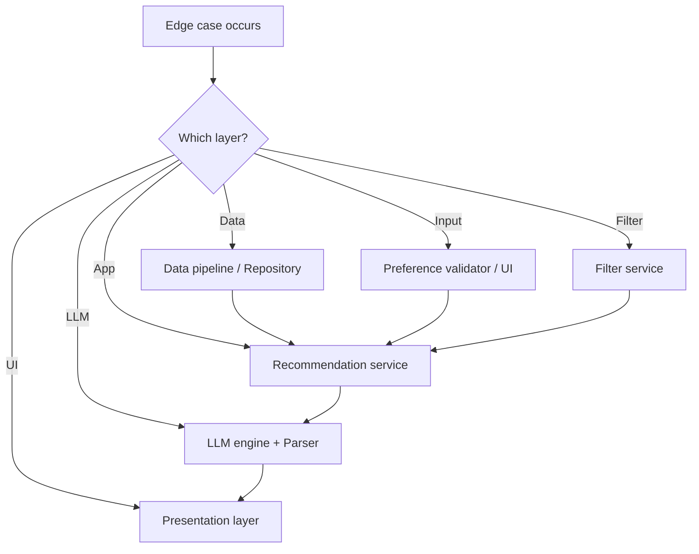

# Edge Cases & Handling Guide

This document catalogs edge cases for the AI-powered restaurant recommendation system ([`context.md`](context.md), [`architecture.md`](architecture.md), [`implementation-plan.md`](implementation-plan.md)). For each case: **scenario**, **expected behavior**, **owner component**, and **test priority**.

**Priority legend:** `P0` = must handle before MVP demo · `P1` = should handle in MVP · `P2` = nice-to-have / Phase 7

---

## How to Use This Document

1. Implement handlers in the listed component during the matching implementation phase.
2. Add automated tests where a **Test ID** is provided.
3. Mark cases as done in the [Implementation checklist](#implementation-checklist) at the end.



---

## 1. Data Ingestion & Storage

| ID | Scenario | Expected behavior | Component | Priority |
|----|----------|-------------------|-----------|----------|
| D-01 | Hugging Face download fails (network, 503) | Log error; exit pipeline with non-zero code; message: run again or check connection | `loader.py` | P0 |
| D-02 | Dataset repo renamed or schema changed | Fail fast with clear log listing actual columns; do not write corrupt cache | `loader.py`, `preprocessor.py` | P0 |
| D-03 | Missing expected columns after load | Map aliases if documented; else abort with column list | `preprocessor.py` | P0 |
| D-04 | Row missing `name`, `location`, or `rating` | Drop row; increment `dropped_rows` in pipeline stats | `preprocessor.py` | P0 |
| D-05 | `rating` non-numeric (`"4.5/5"`, `"-"`, empty) | Parse best-effort; drop if unparseable | `preprocessor.py` | P0 |
| D-06 | `rating` out of range (< 0 or > 5) | Clamp to [0, 5] or drop if clearly invalid | `preprocessor.py` | P1 |
| D-07 | `cost` missing for many rows | Keep row; set `cost` null; assign `budget_band` via fallback (median impute or `"unknown"`) | `preprocessor.py` | P1 |
| D-08 | `cost` as string (`"₹800 for two"`, `"$$$"`) | Extract numeric via regex; null if impossible | `preprocessor.py` | P0 |
| D-09 | `cost` is zero or negative | Treat as null; do not use for percentile bands | `preprocessor.py` | P1 |
| D-10 | Duplicate `name` + `location` | Keep row with highest `rating`; log duplicate count | `preprocessor.py` | P0 |
| D-11 | City alias (`Bengaluru`, `bengaluru`, `BANGALORE`) | Normalize to canonical city (e.g. `Bangalore`) | `preprocessor.py` | P0 |
| D-12 | Location is neighborhood not city (`Koramangala`) | Store as-is; filter uses exact/normalized match; document in README | `preprocessor.py`, `filter_service` | P1 |
| D-13 | Multi-value cuisine (`"Italian, Chinese"`) | Store full string; filter uses case-insensitive substring match | `preprocessor.py`, `filter_service` | P0 |
| D-14 | Empty cuisine string | Keep row; cuisine filter skipped if user did not specify cuisine | `preprocessor.py` | P1 |
| D-15 | Entire dataset has < 10 valid rows after clean | Abort pipeline; do not write cache | `run_pipeline` | P0 |
| D-16 | `restaurants.parquet` exists and `FORCE_REFRESH=false` | Skip HF download; load from cache | `run_pipeline` | P0 |
| D-17 | Corrupt or truncated parquet file | Detect on read failure; delete or ignore cache; re-run full pipeline | `repository.py`, `run_pipeline` | P1 |
| D-18 | All costs identical (zero variance) | Assign all rows same `budget_band` (e.g. `medium`); log warning | `preprocessor.py` | P1 |
| D-19 | Very large dataset (>100k rows) | Pipeline completes; optional row limit for dev via env `MAX_ROWS` | `preprocessor.py` | P2 |
| D-20 | ID collision after hash | Append numeric suffix to guarantee unique `id` | `preprocessor.py` | P1 |

**D-11 test:** `tests/test_preprocessor.py` — assert `normalize_city("Bengaluru") == "Bangalore"`.

**D-10 test:** Two rows same name/location, different ratings → one row remains, higher rating kept.

---

## 2. User Input & Validation

| ID | Scenario | Expected behavior | Component | Priority |
|----|----------|-------------------|-----------|----------|
| U-01 | Empty `location` | Reject before filter/LLM; UI: "Location is required" | Validator, UI | P0 |
| U-02 | `location` with only whitespace | Trim; if still empty → U-01 | Validator | P0 |
| U-03 | Unknown city not in dataset (`"Paris"`) | Filter returns zero candidates; empty state (not an error) | Filter + UI | P0 |
| U-04 | City spelling variant (`"Delhi NCR"`, `"New Delhi"`) | Prefer dropdown from dataset cities; free text uses normalized match if alias exists | Validator, UI | P1 |
| U-05 | Missing `budget` | Default to `medium` or reject with clear message (pick one; document in README) | Validator | P0 |
| U-06 | Invalid `budget` value (`"cheap"`, `""`) | Reject with allowed values: low, medium, high | Validator | P0 |
| U-07 | `min_rating` not provided | Default to `0.0` or `3.0` (document choice) | Validator | P1 |
| U-08 | `min_rating` < 0 or > 5 | Clamp to [0, 5] | Validator | P0 |
| U-09 | `min_rating` impossibly high (e.g. 4.9) with strict filters | Zero matches → empty state | Filter + UI | P0 |
| U-10 | Optional `cuisine` empty or whitespace | Treat as no cuisine filter | Validator, Filter | P0 |
| U-11 | `cuisine` with special characters (`"Café"`) | Unicode-safe trim; substring match on normalized lowercase | Validator, Filter | P1 |
| U-12 | `additional` very long (>2000 chars) | Truncate for prompt (e.g. 500 chars) with log; do not truncate for display if shown | Validator, Prompt builder | P1 |
| U-13 | `additional` contains prompt injection (`"Ignore instructions..."`) | Pass as user preference text only; system prompt forbids overriding rules; never execute as code | Prompt builder | P1 |
| U-14 | `additional` empty | Omit from prompt or state `"none"` | Prompt builder | P1 |
| U-15 | All fields at strictest values | Zero matches; suggest relaxing filters | UI empty state | P0 |
| U-16 | SQL/script in text fields | Sanitize for logs only; use parameterized data access (no raw SQL from user input) | Validator, logging | P1 |
| U-17 | Concurrent form submissions (double-click) | Disable button / debounce while request in flight | UI | P1 |
| U-18 | Non-ASCII location (`"मुंबई"`) | Match only if dataset contains equivalent; else empty result | Filter | P2 |

**U-01 UX copy:** *"Please enter a city where we have restaurant data (e.g. Delhi, Bangalore)."*

---

## 3. Filtering & Candidate Preparation

| ID | Scenario | Expected behavior | Component | Priority |
|----|----------|-------------------|-----------|----------|
| F-01 | Zero restaurants match all filters | Return `[]`; skip LLM; `metadata.message` explains no matches | Filter, Orchestrator | P0 |
| F-02 | Exactly one match | Return single candidate; LLM still allowed (or skip LLM with single-item template—document choice) | Filter, Orchestrator | P1 |
| F-03 | Thousands of matches | Cap to `MAX_CANDIDATES` (default 30) by highest `rating` | Filter | P0 |
| F-04 | Match count < `TOP_N` (e.g. 2 matches, TOP_N=5) | Return all matches; LLM ranks only available ids | Filter, LLM | P0 |
| F-05 | Cuisine filter too strict (`"Ethiopian"` in sparse data) | Zero matches → empty state | Filter | P0 |
| F-06 | Budget `low` but all local restaurants are `medium` band | Zero matches; suggest changing budget | Filter, UI | P0 |
| F-07 | Case-insensitive location (`"bangalore"`) | Match normalized `Bangalore` | Filter | P0 |
| F-08 | User budget vs row `budget_band` mismatch | Hard filter on `budget_band`; no LLM override of budget | Filter | P0 |
| F-09 | `min_rating` boundary (rating == 4.0, min 4.0) | Include restaurant (inclusive `>=`) | Filter | P0 |
| F-10 | Floating-point rating comparison | Use tolerant compare or round to 1 decimal before compare | Filter | P1 |
| F-11 | Repository not loaded at startup | Fail fast on first request: "Dataset not loaded. Run data pipeline." | Repository, Orchestrator | P0 |
| F-12 | Stale in-memory cache after parquet refresh | Reload repository on app start; document restart after pipeline | Repository | P1 |
| F-13 | Candidate serialization with null `cost` | Omit or send `"unknown"` in JSON; explanation may say cost not listed | Filter → Prompt | P1 |
| F-14 | Duplicate ids in candidate list (should not happen) | Deduplicate by `id` before prompt | Filter | P1 |

**F-01 metadata example:**

```json
{
  "candidates_considered": 0,
  "message": "No restaurants match your filters. Try lowering minimum rating, changing cuisine, or selecting a different budget."
}
```

---

## 4. Integration Layer & Prompts

| ID | Scenario | Expected behavior | Component | Priority |
|----|----------|-------------------|-----------|----------|
| I-01 | Empty candidate list passed to prompt builder | Do not call LLM; raise or return early at orchestrator | Prompt builder, Orchestrator | P0 |
| I-02 | Candidate list exceeds token budget | Already capped by F-03; if still too large, reduce `MAX_CANDIDATES` | Config, Filter | P1 |
| I-03 | Restaurant name with quotes/newlines in JSON | Escape properly in `json.dumps` for embedded CANDIDATES | Prompt builder | P0 |
| I-04 | Unicode emoji in restaurant name | UTF-8 safe prompt; no mojibake | Prompt builder | P1 |
| I-05 | User `additional` conflicts with hard filters ("cheap" but budget high) | LLM may discuss trade-off; hard filters already applied—candidates respect budget | Prompt + Filter | P1 |
| I-06 | `TOP_N` > candidate count | Prompt asks for `min(TOP_N, len(candidates))` | Prompt builder | P0 |
| I-07 | `TOP_N` = 0 or negative in config | Clamp to 1 or use default 5 | Config | P1 |
| I-08 | Missing optional fields in candidate dict | Only include fields present; never invent data in prompt | Prompt builder | P0 |

---

## 5. LLM & Recommendation Engine

| ID | Scenario | Expected behavior | Component | Priority |
|----|----------|-------------------|-----------|----------|
| L-01 | `LLM_API_KEY` missing or invalid | Startup warning in UI; on request: fallback ranking + banner "AI unavailable" | Config, LLM client, UI | P0 |
| L-02 | LLM API timeout | Retry once optional; then fallback by rating + user-visible notice | LLM client, Orchestrator | P0 |
| L-03 | Rate limit (429) | Backoff once; then fallback | LLM client | P1 |
| L-04 | Response is valid text but not JSON | Retry once with "JSON only"; then fallback | Parser | P0 |
| L-05 | JSON wrapped in markdown fences | Strip fences before parse | Parser | P0 |
| L-06 | Partial JSON (truncated) | Fallback; log `parse_error` | Parser | P0 |
| L-07 | LLM returns restaurant `id` not in candidates | Drop entry; log hallucination; re-rank remaining | Parser, Validator | P0 |
| L-08 | Duplicate ranks or missing ranks | Renumber ranks 1..N sequentially | Parser | P1 |
| L-09 | Fewer than `TOP_N` items in LLM output | Return what is valid; fill from fallback only if policy says so | Parser, Orchestrator | P1 |
| L-10 | More than `TOP_N` items | Take top `TOP_N` by rank field | Parser | P1 |
| L-11 | Empty `explanation` for an item | Use generic: "Matches your preferences based on rating and filters." | Response mapper | P1 |
| L-12 | `summary` null or empty | Omit summary block in UI | UI | P1 |
| L-13 | LLM recommends same `id` twice | Deduplicate; keep first rank | Parser | P1 |
| L-14 | Model refuses ("I can't help") | Fallback ranking | LLM client | P1 |
| L-15 | Extremely high token usage (huge candidates) | Prevent via F-03; monitor log | Filter, Config | P1 |
| L-16 | Temperature misconfiguration | Cap 0.2–0.5 in client defaults | LLM client | P2 |
| L-17 | All LLM items invalid after id check | Full fallback list from candidates | Orchestrator | P0 |
| L-18 | Network intermittent mid-stream | Treat as timeout → L-02 | LLM client | P1 |

**Fallback explanation template (L-02, L-17):**

> *"Ranked by rating among restaurants matching your filters. AI explanations are temporarily unavailable."*

**Hallucination rule (architecture §8.2):** Never display a restaurant whose `id` was not in the filtered candidate set.

---

## 6. Application Orchestration

| ID | Scenario | Expected behavior | Component | Priority |
|----|----------|-------------------|-----------|----------|
| O-01 | `get_recommendations` called with invalid Pydantic model | Validation error → 422 (API) or inline error (UI) | Validator | P0 |
| O-02 | Filter returns [] | Skip LLM; return `items: []` + helpful metadata | Orchestrator | P0 |
| O-03 | LLM succeeds but merge fails (id not found) | Skip item; continue with valid merges | Response mapper | P0 |
| O-04 | Partial success (3 valid of 5 LLM items) | Return 3 items; log warning | Orchestrator | P0 |
| O-05 | Exception in filter (bug) | Log stack trace; user message: generic error, no stack trace | Orchestrator, UI | P0 |
| O-06 | `metadata.fallback=true` | UI shows non-blocking banner | UI | P0 |
| O-07 | Repeated identical requests | Idempotent; no server-side cache required for MVP | Orchestrator | P2 |
| O-08 | Orchestrator called before dataset bootstrap | Clear error with pipeline instructions | Orchestrator | P0 |

---

## 7. Presentation & Output Display

| ID | Scenario | Expected behavior | Component | Priority |
|----|----------|-------------------|-----------|----------|
| P-01 | Zero results | Empty state + bullets: lower rating, change cuisine, change budget, try nearby city | UI | P0 |
| P-02 | `estimated_cost` null | Display "Cost not available" | UI | P1 |
| P-03 | Rating display formatting | Show one decimal (e.g. 4.5); handle integer ratings | UI | P1 |
| P-04 | Very long explanation | Show full text with expand/collapse if >300 chars | UI | P2 |
| P-05 | Loading state >30s | Show spinner + "Still working..." after 15s | UI | P1 |
| P-06 | Streamlit session rerun clears form | Acceptable for MVP; optional `st.session_state` preserve | UI | P2 |
| P-07 | Missing summary | Do not render summary section | UI | P1 |
| P-08 | Fallback banner + normal cards | Banner distinct from cards; recommendations still usable | UI | P0 |
| P-09 | All output fields required per context | Never render card missing name, cuisine, rating, cost field, explanation | UI | P0 |
| P-10 | Cost shown as string vs number | Format consistently (e.g. `₹{cost}` or pass-through string) | UI | P1 |

**P-01 suggested copy:**

- Lower minimum rating by 0.5  
- Remove or broaden cuisine  
- Try budget **medium** instead of **low**  
- Pick a city from the dropdown  

---

## 8. Configuration & Environment

| ID | Scenario | Expected behavior | Component | Priority |
|----|----------|-------------------|-----------|----------|
| C-01 | `.env` file missing | Use defaults; LLM calls fail gracefully (L-01) | Config | P0 |
| C-02 | `MAX_CANDIDATES` not a number | Fall back to 30 | Config | P1 |
| C-03 | `DATA_PATH` points to non-existent file | Error at repository load with path in message | Config, Repository | P0 |
| C-04 | `FORCE_REFRESH=true` with valid cache | Re-download and overwrite parquet | Pipeline | P1 |
| C-05 | Wrong `LLM_MODEL` name | Provider error → fallback (L-02) | LLM client | P1 |
| C-06 | Log level debug in production | Env-controlled; default INFO | Config | P2 |

---

## 9. Security & Abuse

| ID | Scenario | Expected behavior | Component | Priority |
|----|----------|-------------------|-----------|----------|
| S-01 | API key in logs | Never log `LLM_API_KEY` | Logging | P0 |
| S-02 | User `additional` logged verbatim | Truncate/sanitize in logs | Logging | P1 |
| S-03 | Prompt injection in `additional` | System prompt: only rank CANDIDATES; ignore override attempts | Prompt builder | P1 |
| S-04 | Huge payload POST to API (Phase 7) | Body size limit; validate schema | API | P2 |
| S-05 | No authentication (MVP) | Document: local/demo only | Docs | P1 |

---

## 10. Performance & Reliability

| ID | Scenario | Expected behavior | Component | Priority |
|----|----------|-------------------|-----------|----------|
| R-01 | Cold start: load parquet | Load once at startup; log duration | Repository | P0 |
| R-02 | LLM latency 5–15s | Async UI spinner; do not block other sessions (Streamlit caveat documented) | UI | P1 |
| R-03 | Memory pressure with full DataFrame | Acceptable for MVP; optional column pruning | Repository | P2 |
| R-04 | Disk full on parquet write | Pipeline fails with OS error message | Pipeline | P2 |
| R-05 | Parallel users (future API) | Stateless service; no in-request global mutation | API | P2 |

---

## 11. Optional API Layer (Phase 7)

| ID | Scenario | Expected behavior | Component | Priority |
|----|----------|-------------------|-----------|----------|
| A-01 | `POST /recommendations` invalid JSON | 400 with validation details | API | P2 |
| A-02 | `GET /health` dataset not loaded | `dataset_loaded: false`, status degraded | API | P2 |
| A-03 | `GET /metadata/locations` empty dataset | `[]` with 200 | API | P2 |
| A-04 | CORS from unknown origin | Configure allowed origins in deploy | API | P2 |

---

## 12. Decision Matrix: Skip LLM vs Call LLM

| Condition | Action |
|-----------|--------|
| `candidates.length == 0` | Skip LLM · empty response |
| `candidates.length > 0` and API key valid | Call LLM |
| `candidates.length > 0` and API key missing / LLM error | Fallback rank by rating |
| LLM returns zero valid ids after validation | Full fallback |

---

## 13. Test Coverage Map

| Area | Test file | Edge IDs |
|------|-----------|----------|
| Preprocessor | `tests/test_preprocessor.py` | D-05, D-10, D-11, D-18 |
| Filter | `tests/test_filter_service.py` | F-01, F-03, F-07, F-09 |
| Prompt | `tests/test_prompt_builder.py` | I-01, I-06, I-03 |
| Parser | `tests/test_parser.py` | L-04, L-05, L-07, L-13 |
| Orchestrator | `tests/test_recommendation_service.py` | O-02, O-04, O-17, F-01 + L-17 |
| E2E (slow) | `tests/test_e2e.py` | L-02 with mock |

---

## 14. Implementation Checklist

Track handling as features are built:

### Data (Phase 1)
- [ ] D-01 – D-11, D-15 – D-17
- [ ] D-07 – D-09, D-18 – D-20

### Domain & filter (Phase 2)
- [ ] F-01 – F-11, F-14

### LLM (Phase 3)
- [ ] L-01 – L-11, L-13 – L-17
- [ ] I-01, I-03, I-06, I-08

### Orchestration (Phase 4)
- [ ] O-01 – O-06, O-08

### UI (Phase 5)
- [ ] U-01 – U-06, U-08 – U-10, U-15, P-01, P-08, P-09
- [ ] P-02, P-05, P-07

### Polish (Phase 6)
- [ ] Remaining P1 items
- [ ] Security S-01 – S-03
- [ ] Config C-01 – C-05

### Extensions (Phase 7)
- [ ] A-01 – A-04, P2 items as needed

---

## 15. References

- [`context.md`](context.md) — success criteria, workflow
- [`architecture.md`](architecture.md) — §8.2 hallucination controls, §9.3 empty/error states
- [`implementation-plan.md`](implementation-plan.md) — risk register, phase mapping
