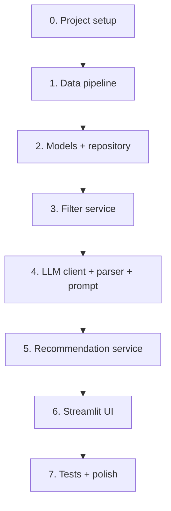

# Implementation Guide

This document turns [`context.md`](context.md) (product requirements) and [`architecture.md`](architecture.md) (technical design) into concrete implementation steps, contracts, and verification criteria. Use it as the primary handbook while building the system.

**Related docs:** [`architecture.md`](architecture.md) · [`context.md`](context.md) · [`edge-cases.md`](edge-cases.md) · [`docs/ProblemStatement.txt`](docs/ProblemStatement.txt)

---

## 1. What You Are Building

An AI-powered restaurant recommender inspired by Zomato that:

1. Accepts **user preferences** (location, budget, cuisine, minimum rating, optional extras)
2. Uses the **Hugging Face Zomato dataset** as the sole restaurant source
3. Applies **deterministic filters** first, then an **LLM** to rank and explain
4. Returns a **user-friendly shortlist** with consistent fields per restaurant

**Dataset:** [ManikaSaini/zomato-restaurant-recommendation](https://huggingface.co/datasets/ManikaSaini/zomato-restaurant-recommendation)

**MVP stack (recommended):** Python 3.11+, `pandas`, `datasets`, `pydantic`, `streamlit`, one LLM provider (e.g. OpenAI).

---

## 2. Implementation Principles

Derived from architectural goals:

| Principle | Implementation rule |
|-----------|---------------------|
| Hybrid intelligence | Hard filters in code; soft preferences and narrative in LLM |
| Separation of concerns | No LLM calls in UI; no filtering logic in prompt builder |
| Testability | Mock `LLMClient` in service tests; unit-test filter and parser alone |
| Single entry point | All recommendation requests go through `RecommendationService.get_recommendations()` |
| No hallucinated venues | LLM may only return `id` values from the filtered candidate list |
| Fail gracefully | Empty filter → skip LLM; LLM failure → rating-based fallback with notice |

---

## 3. Context Workflow → Code Mapping

| # | Context stage | What to implement | Key files |
|---|---------------|-------------------|-----------|
| 1 | Data ingestion | Load HF data, clean, enrich, cache | `src/data/loader.py`, `preprocessor.py`, `run_pipeline` |
| 2 | User input | Form + validation | `src/models/preferences.py`, `src/app/ui.py` |
| 3 | Integration layer | Filter + prompt prep | `filter_service.py`, `prompt_builder.py` |
| 4 | Recommendation engine | LLM rank + explain | `src/llm/client.py`, `parser.py` |
| 5 | Output display | Cards with required fields | `src/app/ui.py`, `models/recommendation.py` |

---

## 4. Repository Layout

Create this structure (from architecture §10):

```
zomato-milestone/
├── context.md
├── architecture.md
├── implementation.md          # this file
├── edge-cases.md
├── docs/ProblemStatement.txt
├── data/processed/            # gitignored — restaurants.parquet
├── src/
│   ├── config.py
│   ├── data/
│   │   ├── loader.py
│   │   ├── preprocessor.py
│   │   ├── repository.py
│   │   └── run_pipeline.py
│   ├── models/
│   │   ├── restaurant.py
│   │   ├── preferences.py
│   │   └── recommendation.py
│   ├── services/
│   │   ├── filter_service.py
│   │   ├── prompt_builder.py
│   │   └── recommendation_service.py
│   ├── llm/
│   │   ├── client.py
│   │   └── parser.py
│   └── app/
│       ├── ui.py
│       └── api.py             # optional Phase 7
├── tests/
├── requirements.txt
├── .env.example
└── .gitignore
```

---

## 5. Build Order

Implement in this sequence so each layer has dependencies ready:



| Step | Deliverable | Blocks |
|------|-------------|--------|
| 0 | `requirements.txt`, `config.py`, `.env.example`, folders | Everything |
| 1 | `restaurants.parquet` with normalized schema | Filter, UI metadata |
| 2 | Pydantic models + `RestaurantRepository` | Filter, orchestrator |
| 3 | `FilterService.filter()` | Prompt, orchestrator |
| 4 | `PromptBuilder`, `LLMClient`, `parse_llm_response()` | Orchestrator |
| 5 | `RecommendationService.get_recommendations()` | UI |
| 6 | Streamlit form + result cards | Demo |
| 7 | `pytest` suite + README | Handoff |

---

## 6. Configuration

**File:** `src/config.py` (use `pydantic-settings`)

| Variable | Default | Purpose |
|----------|---------|---------|
| `LLM_API_KEY` | — | Provider auth (required for AI explanations) |
| `LLM_MODEL` | `gpt-4o-mini` | Model id |
| `MAX_CANDIDATES` | `30` | Max rows sent to LLM |
| `TOP_N` | `5` | Recommendations returned |
| `DATA_PATH` | `data/processed/restaurants.parquet` | Processed dataset |
| `FORCE_REFRESH` | `false` | Re-download from Hugging Face |
| `LOG_LEVEL` | `INFO` | Logging verbosity |

**`.env.example`:** Document all variables; never commit `.env`.

---

## 7. Domain Models (Contracts)

Implement with Pydantic in `src/models/`.

### 7.1 `Restaurant` (stored / filtered)

```python
class Restaurant(BaseModel):
    id: str
    name: str
    location: str
    cuisine: str
    rating: float
    cost: float | None = None
    budget_band: Literal["low", "medium", "high"]
```

### 7.2 `UserPreferences` (input — from context)

```python
class UserPreferences(BaseModel):
    location: str
    budget: Literal["low", "medium", "high"]
    cuisine: str | None = None
    min_rating: float = 0.0
    additional: str | None = None
```

**Validation rules:**

- Trim `location`; reject if empty after trim
- Clamp `min_rating` to `[0.0, 5.0]`
- Treat blank `cuisine` as `None` (no cuisine filter)

### 7.3 `RecommendationItem` (output — from context)

```python
class RecommendationItem(BaseModel):
    rank: int
    name: str
    cuisine: str
    rating: float
    estimated_cost: str | float
    explanation: str
```

### 7.4 `RecommendationResponse`

```python
class RecommendationResponse(BaseModel):
    items: list[RecommendationItem]
    summary: str | None = None
    metadata: dict = {}
```

**Metadata keys (recommended):** `candidates_considered`, `filters_applied`, `fallback` (bool), `message` (for empty results).

---

## 8. Stage 1 — Data Ingestion

**Goal (context §1):** Reliable load/preprocess of Hugging Face data; runtime reads local cache only.

### 8.1 Loader (`src/data/loader.py`)

```python
def load_raw_dataset() -> pd.DataFrame:
    from datasets import load_dataset
    ds = load_dataset("ManikaSaini/zomato-restaurant-recommendation")
    # Use train split or first available split
    return ds["train"].to_pandas()
```

- On first run: discover columns; map to `name`, `location`, `cuisine`, `cost`, `rating`
- Log column mapping if names differ from expectations (see [`edge-cases.md`](edge-cases.md) D-02, D-03)

### 8.2 Preprocessor (`src/data/preprocessor.py`)

| Task | Implementation |
|------|----------------|
| Clean strings | `str.strip()` on text fields |
| Parse rating | `pd.to_numeric`, drop if NaN |
| Parse cost | Regex extract digits; allow null |
| City normalize | Map `Bengaluru` → `Bangalore`; title-case |
| Budget bands | Compute cost 33rd/66th percentiles → `low` / `medium` / `high` |
| Stable `id` | `r_{index}` or hash of `name|location` |
| Dedupe | Same `name` + `location` → keep highest `rating` |
| Drop invalid | Missing `name`, `location`, or `rating` |

### 8.3 Pipeline runner (`src/data/run_pipeline.py`)

```
IF cache exists AND NOT FORCE_REFRESH:
    log "Using cached data"
ELSE:
  raw = load_raw_dataset()
  processed = preprocess(raw)
  write parquet to DATA_PATH
```

### 8.4 Repository (`src/data/repository.py`)

- `load() -> list[Restaurant]` — read parquet at startup
- `get_locations() -> list[str]` — distinct cities for UI dropdown
- Hold in-memory list or DataFrame for fast filtering

---

## 9. Stage 2 — User Input

**Goal (context §2):** Collect all preference fields with validation.

### 9.1 Streamlit UI (`src/app/ui.py`)

| Control | Type | Notes |
|---------|------|-------|
| Location | `selectbox` from `repository.get_locations()` | Prefer dataset cities |
| Budget | `selectbox`: low, medium, high | Required |
| Cuisine | `text_input` optional | |
| Min rating | `slider` 0.0–5.0 step 0.5 | |
| Additional | `text_area` optional | family-friendly, etc. |
| Submit | `button` | Disable while loading |

### 9.2 UX requirements (architecture §3.1, §9.3)

- `st.spinner` during `get_recommendations()`
- Empty state when zero matches (suggest relaxing filters)
- Banner when `metadata.fallback is True`

---

## 10. Stage 3 — Integration Layer

**Goal (context §3):** Filter data, prepare bounded candidates, build LLM prompt.

### 10.1 Filter service (`src/services/filter_service.py`)

```python
def filter(
    preferences: UserPreferences,
    restaurants: list[Restaurant],
    max_candidates: int = 30,
) -> list[Restaurant]:
```

| Predicate | Logic |
|-----------|--------|
| Location | Case-insensitive equality on normalized `location` |
| Min rating | `restaurant.rating >= preferences.min_rating` |
| Cuisine | If set: substring match on `cuisine` (case-insensitive) |
| Budget | `restaurant.budget_band == preferences.budget` |
| Cap | Sort by `rating` desc; take first `max_candidates` |

**If result is empty:** orchestrator skips LLM (architecture §5.2 step 4).

### 10.2 Candidate serialization

```python
def to_candidate_dicts(restaurants: list[Restaurant]) -> list[dict]:
    return [
        {
            "id": r.id,
            "name": r.name,
            "location": r.location,
            "cuisine": r.cuisine,
            "rating": r.rating,
            "cost": r.cost,
        }
        for r in restaurants
    ]
```

Use `json.dumps` for embedding in prompts (handles escaping — edge case I-03).

### 10.3 Prompt builder (`src/services/prompt_builder.py`)

Follow architecture §7.3 template:

- **System:** Indian cities context; rank only from `CANDIDATES`; JSON output only
- **User constraints:** location, budget, cuisine or `"any"`, min_rating, additional or `"none"`
- **CANDIDATES:** JSON array from §10.2
- **Task:** Top `TOP_N`, 1–2 sentence explanation each, optional summary
- **Output schema:** `{ recommendations: [{ id, rank, explanation }], summary }`

---

## 11. Stage 4 — Recommendation Engine

**Goal (context §4):** Rank, explain, optionally summarize via LLM.

### 11.1 Division of labor (architecture §8.1)

| Task | Owner |
|------|--------|
| Location, rating, cuisine, budget | `FilterService` |
| family-friendly, quick service, trade-offs | LLM |
| Final order among candidates | LLM |
| Per-item explanation + summary | LLM |

### 11.2 LLM client (`src/llm/client.py`)

```python
class LLMClient(Protocol):
    def complete(self, prompt: str) -> str: ...

class OpenAIClient(LLMClient):
  # temperature 0.2–0.5
  # read LLM_API_KEY, LLM_MODEL from config
```

### 11.3 Parser (`src/llm/parser.py`)

1. Strip markdown code fences if present
2. `json.loads` response
3. Validate each `id` ∈ candidate ids (hallucination guard — §8.2)
4. Renumber ranks 1..N
5. On failure: retry once with “JSON only”; else raise for fallback

### 11.4 Merge LLM output with restaurants

```python
def merge_recommendations(
    llm_items: list[dict],
    candidates: list[Restaurant],
) -> list[RecommendationItem]:
    by_id = {r.id: r for r in candidates}
    # Join id + explanation → full RecommendationItem
```

### 11.5 Fallback (architecture §3.3.3)

When LLM unavailable or parse fails:

- Sort candidates by `rating` desc
- Take top `TOP_N`
- Generic explanation: *"Ranked by rating among restaurants matching your filters. AI explanations are temporarily unavailable."*
- Set `metadata["fallback"] = True`

---

## 12. Stage 5 — Application Orchestration

**File:** `src/services/recommendation_service.py`

```python
class RecommendationService:
    def __init__(
        self,
        repository: RestaurantRepository,
        filter_service: FilterService,
        prompt_builder: PromptBuilder,
        llm_client: LLMClient,
    ): ...

    def get_recommendations(
        self, preferences: UserPreferences
    ) -> RecommendationResponse:
```

### 12.1 Runtime algorithm

```
1. preferences = validate(preferences)
2. candidates = filter_service.filter(preferences, repository.all())
3. IF len(candidates) == 0:
       RETURN empty items + metadata.message
4. TRY:
       prompt = prompt_builder.build(preferences, candidates)
       raw = llm_client.complete(prompt)
       parsed = parse_llm_response(raw, candidate_ids)
       items = merge_recommendations(parsed, candidates)
       summary = parsed.get("summary")
   EXCEPT:
       items = fallback_rank(candidates)
       metadata.fallback = True
5. RETURN RecommendationResponse(items, summary, metadata)
```

This implements architecture §5.2 request flow end-to-end.

---

## 13. Stage 6 — Output Display

**Goal (context §5):** Every result shows name, cuisine, rating, estimated cost, explanation.

### 13.1 Result card template

```
# {rank}  {name}                    ★ {rating}
    {cuisine} · {location} · {cost_display}
    "{explanation}"
```

- `cost_display`: format numeric as `₹{cost}` or `"Cost not available"` if null
- Optional summary paragraph above cards when `response.summary` is set

### 13.2 Required vs optional UI blocks

| Block | Required |
|-------|----------|
| Preference form | Yes |
| Loading spinner | Yes |
| Recommendation cards (5 fields) | Yes |
| Summary | No |
| Fallback banner | When `metadata.fallback` |
| Empty-state hints | When `items` empty |

---

## 14. Testing

Align with architecture §13.4.

| Module | Test file | Focus |
|--------|-----------|-------|
| Preprocessor | `tests/test_preprocessor.py` | City normalize, budget bands, required columns |
| Filter | `tests/test_filter_service.py` | Location, cuisine, rating, budget, cap |
| Prompt | `tests/test_prompt_builder.py` | Contains CANDIDATES, constraints, TOP_N |
| Parser | `tests/test_parser.py` | Valid JSON, fences, invalid ids |
| Orchestrator | `tests/test_recommendation_service.py` | Empty skip LLM, mock LLM, fallback |

```bash
pip install pytest
pytest tests/ -v
# Optional live LLM:
pytest tests/ -v -m slow
```

Use [`edge-cases.md`](edge-cases.md) §13 for case IDs to cover.

---

## 15. Commands (Quick Reference)

```bash
# Setup
python -m venv .venv
.venv\Scripts\activate          # Windows
pip install -r requirements.txt
copy .env.example .env          # add LLM_API_KEY

# Bootstrap data (once)
python -m src.data.run_pipeline

# Run app
streamlit run src/app/ui.py

# Tests
pytest tests/ -v
```

---

## 16. Optional REST API (Extension)

From architecture §12 — implement only if needed:

| Endpoint | Implementation |
|----------|----------------|
| `POST /api/v1/recommendations` | Body → `UserPreferences`; call `get_recommendations` |
| `GET /api/v1/health` | `dataset_loaded: bool` |
| `GET /api/v1/metadata/locations` | `repository.get_locations()` |

Use FastAPI in `src/app/api.py`; keep business logic in `RecommendationService`.

---

## 17. Security & Operations

| Rule | Source |
|------|--------|
| Never commit `LLM_API_KEY` | architecture §13.3 |
| Truncate `additional` in logs | edge-cases S-02 |
| System prompt: only rank CANDIDATES | architecture §8.2 |
| Log filter count + LLM latency | architecture §13.2 |
| No auth for MVP | context out-of-scope |

---

## 18. Verification Checklists

### 18.1 Context success criteria

- [ ] User can specify location, budget, cuisine, rating, and extra preferences
- [ ] Ranked shortlist with human-readable rationale per restaurant
- [ ] Output fields: name, cuisine, rating, cost, explanation
- [ ] Recommendations reflect **filters** and **LLM judgment**

### 18.2 Architecture verification (§16)

- [ ] Dataset cached; no per-request Hugging Face download
- [ ] Hard filters run before any LLM call
- [ ] Every displayed restaurant ∈ filtered candidate set
- [ ] Full output contract on each item
- [ ] LLM failure → rating fallback with user-visible notice
- [ ] Core services unit-testable without network

### 18.3 Demo readiness

- [ ] Pipeline produced `data/processed/restaurants.parquet`
- [ ] Streamlit runs with dropdown cities from dataset
- [ ] Sample query (e.g. Bangalore, medium, Italian, 4.0) returns 1–5 cards
- [ ] Empty strict query shows helpful empty state

---

## 19. Out of Scope (MVP)

Per context — do not implement unless explicitly extended:

- User accounts / authentication
- Live Zomato API
- Multi-provider LLM routing
- Cloud deployment (local Streamlit is sufficient for MVP)

---

## 20. Document Index

| Document | Use when |
|----------|----------|
| [`context.md`](context.md) | Understanding product goals and workflow |
| [`architecture.md`](architecture.md) | Diagrams, layer boundaries, prompt schema |
| **`implementation.md`** | **Building modules, contracts, commands** |
| [`edge-cases.md`](edge-cases.md) | Handling failures and boundary conditions |
| [`docs/ProblemStatement.txt`](docs/ProblemStatement.txt) | Original assignment text |
